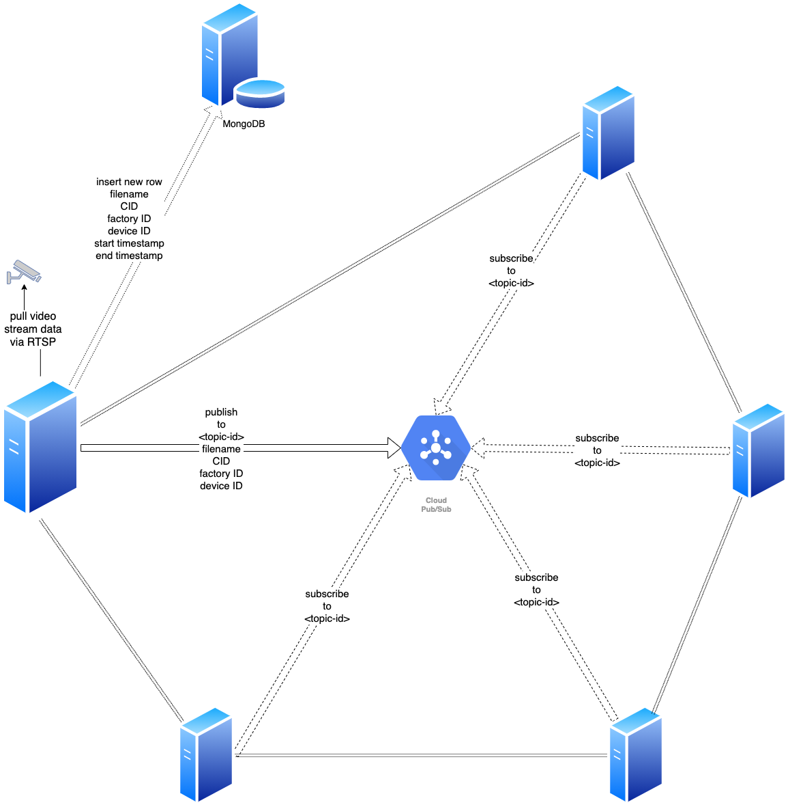

# RFC-ABM-210329 A real-time monitoring data capturer and player -- The Prototype

Author(s): Nathan Yang

## Table of contents
* [Background](#background)
* [Proposal](#proposal)
	* [Functionalities](#functionalities)
	* [Architecture design](#architecture-design)
* [Implementation details](#implementation-details)
* [Rationales](#rationales)
	* [RTSP vs RTMP](#rtsp-vs-rtmp)
	* [Cache invalidation](#cache-invalidation)
	* [Naming things](#naming-things)
	* [Asynchronous callbacks](#asynchronous-callbacks)
	* [Off-by-one errors](#off-by-one-errors)
* [Open questions](#open-questions)
* [Future steps](#future-steps)
* [External resources](#external-resources)

## Background
Nowadays, there's a trend that small- and middle-scale corporations need data solutions to boost their productivity.
However, data solutions offered by big companies such as Alibaba Cloud are not affordable to many small- and middle-scale corporations.
Additionally, centralized services are open to attacks and hence the risk of data breach becomes even higher in such a scenario.
In the light of both affordability and potential privacy leakage issues,
ABMatrix offers an affordable industry internet platform where users can fully manage their data without compromising their privacies.

In the first phase of this project, we aim to build a system that captures data directly from surveillance cameras,
plays the footage and stores the data on the ABMatrix's private IPFS network.

## Proposal

### Functionalities
For a client who uses our service, they should be able to do the following things:
1. Login and authentication
	- clients can only access their own monitors
	- admins and devs can switch among multiple monitors
1. Live-streaming
	- users are able to watch the realtime scene under monitoring
  	- users can move the video progress bar to go back to a pastime within the same day
	- if they have multiple cameras setup they should be able to switch to a different scene
2. Replay
	- users should be able to select a time range of video segments and then watch

### Architecture design

The servers together form a private IPFS network via swarm and IPFS-cluster.
A dedicated server pulls video streams via RTSP from the IP camera,
and encodes ts chunks in a live m3u8 file using `ffmpeg`.
For live-streaming, the server only needs to serve the manifest file
(that ends with `.m3u8`), and the frontend HLS player will handle the rest
such as requesting the chunked files (that end with `.ts`) and caching them in the browser.
A file watcher observes changes under the current directory.
Whenever a new chunked file is generated,
1. IPFS adds the current file, and returns the CID;
1. IPFS cluster pins the CID so that other nodes in the network can replicate the file;
1. insert a new document containing the filename, CID, factory ID, device ID, start and
end timestamps to the MongoDB server; and
1. publish filename, CID, factory and device IDs to a specific topic.

The built-in IPFS HTTP gateway allows those content to be accessed via HTTP,
which is what the embedded player on the website will use.

Other servers in the network subscribe to the specific topic.
Whenever a new message is published to the topic,
1. they will get the file based on the CID and move the content to the current directory; and
1. update the manifest file by inserting new lines with the newly added chunk file.

Theoretically, all participating servers can serve as mirroring servers to live stream
the video. However, the role of these servers are more of replaying servers due to the
latencies of fetching the video data.

## Implementation details

- Implementation languages: `Go` and `javascript`.

- Prerequisites:
	- install `ffmpeg`
	- install `go-ipfs` and start `IPFS daemon`
	- install `ipfs-cluster`
	- [setup a private IPFS network](../docs/ipfs-go-deployment.md)

- Server-side implementation layout
	1. FFMpeg controller
		- connects the network camera and starts encoding to publishable format such as the `ts+m3u8` format combination that's suitable for HLS players embedded in mainstream browsers.
	1. File watcher
		- whenever there's a new stream file generated the watcher notifies the observers to update information accordingly
	1. IPFS controller
	  	- adds the newly generated _.ts_ file and get the CID
		- pins the CID via IPFS cluster
	  	- gets files based on CIDs
		- publishes/resolves content via IPNS
	1. Pub/Sub
		- _for content-generating node_:
			- publishes the filename and CID to a pre-specified topic via pubsub
			- puts CID, filename, start and end timestamps to a database
		- _for non-content-generating peers_:
			- subscribe to the pre-specified topic and gets the CID to local filesystem (mirroring)
	1. MongoDB
		- _for content-generating node_
			- puts CID, filename, start and end timestamps to MongoDB
		- _for all nodes_
			- whenever requested for replaying videos, fetches from MongoDB for CID and filename based on the specified start and end timestamps
	1. Streaming server
	  	- composes video manifest file (ends with _.m3u8_)
		- returns the requested `m3u8` file 

- User interface
	- built on top of the Vue.js framework
	- leverages [Vue-Video-Player](https://www.npmjs.com/package/vue-vjs-hls)
	- live streaming option to see the realtime footages
	- playback option to watch the past footages

## Rationales

### RTSP vs RTMP
We choose RTSP (Real Time Streaming Protocol) over RTMP (Real Time Messaging Protocol)
because RTSP is best suited for CCTV and IP cameras.
Additionally, during the current testing phase we use Hikvision cameras that don't support RTMP.

### Cache invalidation
IPNS publishing and resolving both take a certain amount of time (~2 minutes for each).
If the video streaming was served via IPFS there would be a reduced user experience as there would be a great extent of stall when IPFS is publishing and resolving.
In addition, IPNS with DHT (Distributed Hash Table) takes too long since too many people are behind NAT (Network Address Traversal).
Third, IPNS with PubSub is still undergoing issues such as slow initial resolution time among many others, see [IPNS over PubSub Pinning](#https://github.com/ipfs-shipyard/integration-mini-projects/issues/4) and [Understanding guarantees of the improved IPNS over pubsub](#https://discuss.ipfs.io/t/understanding-guarantees-of-the-improved-ipns-over-pubsub/8713/6).
Considering the number of stream viewers is not at million-scale, we will use n HTTP server to stream video.
Such a mechanism basically multiplexes video streams from a single server and then distributes the content.
In order to make such a live streaming service highly available,
we may need to set up multiple such HTTP servers in case of the single point failure,
i.e., multiple HTTP servers pull data from the RTMP server and listen to HTTP requests for video streaming.

### Naming things
In the event when FFMpeg fails and restarts, the program starts enumerating from the beginning and consequently overwrites the existing indexing file (which ends in `.m3u8`) as well as the existing unit stream data file (that ends in `.ts`).
As a result, there will be duplicate names in the log file and the video stream will then stall.
To avoid such a problem, we need to name each FFMpeg session uniquely (such as using the timestamp) and write a new playlist; i.e., create a new folder and place the stream files under there.

### Asynchronous callbacks
Remember, there are multiple activities (namely the FFMpeg, IPFS daemon, and the processing script for adding, pinning and publishing , etc) happening at the same time and they are inter-connected.
If one of them fails the others get affected and the whole system may crash.
In this case, we need to leverage a self-recovery mechanism and may need to put everything in a loop.

### Off-by-one errors
HLS sequences have time code in them and incorrectly ordered sequences may stall the player.
In addition, rewriting of the time code leads to limited success.
In light of these issues, we need to use the HLS tag which indicates the beginning of a new sequence.

## Open questions
1. How to setup IPFS gateways for a private IPFS network?\
   Use Nginx to load balance the traffic for replaying videos.
   We should also use Nginx to proxy the live stream service.
1. How do we configure each IPFS node
   so that the data is mounted to all hard drives
   given that each IPFS node may have multiple?\
   Currently, IPFS allows only one folder to store data.
   According to [this discussion](https://discuss.ipfs.io/t/how-to-configure-ipfs-to-store-data-over-multiple-folders-or-mounted-drives/3197),
   we may consider using some software to pool multiple disks together
   and mount them under a single mount point. Finally, set the `IPFS_PATH` environment variable
   to a folder under that single mount point.

## Future steps
Data solutions offered by big companies lack customizability as their solutions cannot suit all small corporations.
In light of this, we want to build a decentralized network where developers from the open source community can participate to provide customized solutions for businesses.
The bond between the developers and the requesting businesses will be through smart contracts over blockchain.
The network will also leverage cutting-edge privacy-preserving technologies so that both parties don't need to worry about their privacy being compromised.
Further, we aim to maximize the value of the data from the businesses without sharing the source data themselves.
Such a goal is achievable through the Zero-Knowledge Proof technology.

## External resources
1. [HTTP live streaming](https://tools.ietf.org/html/rfc8216) \
	:point_up_2: this RFC outlines how to write the streaming manifest file.
1. [The definite guide to your high-performance IPFS Gateway](https://blog.stacktical.com/ipfs/gateway/dapp/2019/09/21/ipfs-server-google-cloud-platform.html) \
	:point_up_2: this blog briefly touches on how to setup Nginx proxy and IPFS gateway.
1. [RTMP vs. RTSP: Which Streaming Protocol is Right for Your Business?](https://www.dacast.com/blog/rtmp-vs-rtsp/) \
	:point_up_2: this blog talks about how to choose between RTSP and RTMP.
1. [Simple Load Balancing using Nginx](https://www.nginx.com/resources/wiki/start/topics/examples/loadbalanceexample/) \
	:point_up_2: a template Nginx configuration file for load balancing.
1. [HTTP Load Balancing](https://docs.nginx.com/nginx/admin-guide/load-balancer/http-load-balancer/) \
	:point_up_2: a detailed guide on how to use Nginx for load balancing.
